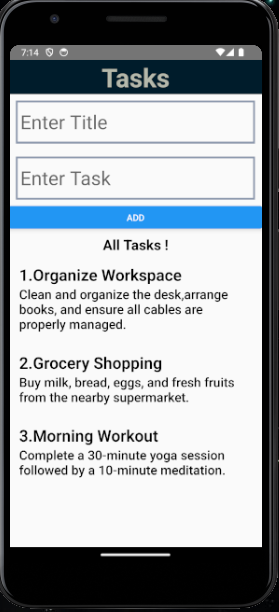

# React Native TodoApp

A simple and intuitive To-Do List application built with React Native. This app allows users to manage tasks, set priorities, and mark completed tasks. It's designed to help users stay organized and productive.

## Features

- **Task Management:** Add, edit, and delete tasks with ease.
- **Task Status:** Mark tasks as completed or pending.
- **Local Storage:** Tasks are stored locally on the device, ensuring they persist between app launches.
- **User Interface:** Clean and easy-to-use UI with a modern design.
- **Cross-Platform:** Works seamlessly on both Android and iOS devices.

## Screenshots



## Tech Stack

- **React Native:** A popular framework for building cross-platform mobile applications.
- **React Navigation:** Used for navigating between screens.
- **AsyncStorage:** Used for persisting tasks data locally on the device.
- **Expo (optional):** A set of tools for building and deploying React Native apps.

## Getting Started

To run this project locally, follow these steps:

### 1. Clone the repository:

```bash
git clone https://github.com/AmanBits/reactnativetodoapp.git
cd reactnativetodoapp
